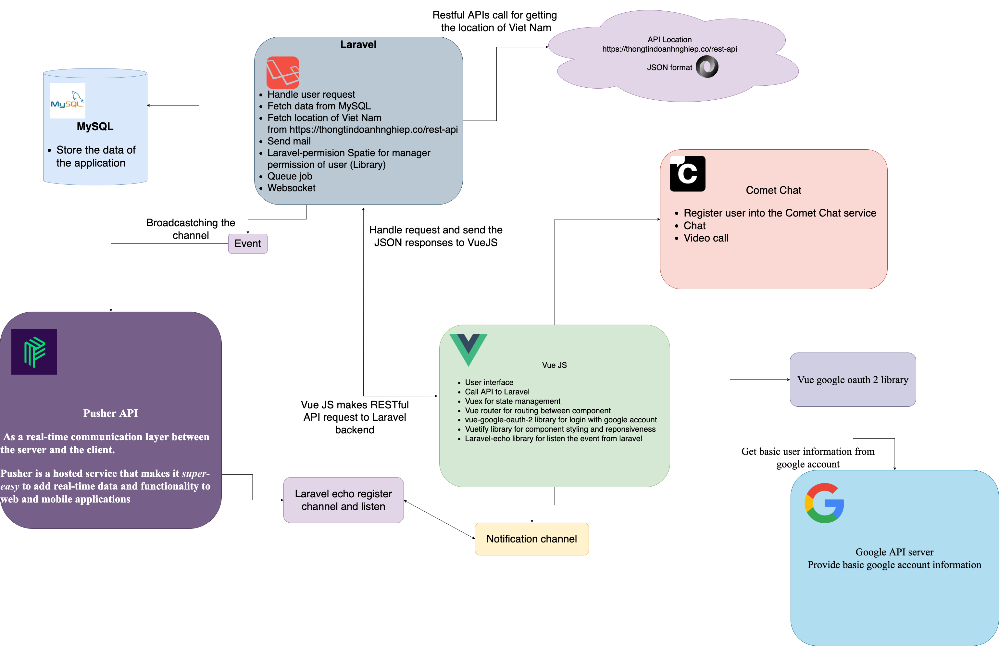

# Healthy social website

#### Author: Tran Ngoc Phuoc - Fullstack developer

#### Contract me: phuoctn412@gmail.com

### This source code is server-side

### Client-site Vue JS repository is here [Healthy social](https://github.com/FPT-Greenwich-University/server-api-healthy-forum "Laravel project")

# Application Architecture



# Demonstration

1. [Posts view page](project-introduce/images/posts.png)
2. [Create post view page](project-introduce/images/create-posts.png)
3. [Search post view page](project-introduce/images/search-posts.png)
4. [Search user view page](project-introduce/images/search-users.png)
5. [Chat and video call view page](project-introduce/images/chat-videocall.png)
6. [Favorite doctor list view page](project-introduce/images/favorite-doctor-list.png)
7. [Favorite post list view page](project-introduce/images/favorite-post.png)
8. [Profile view page](project-introduce/images/profiles.png)

# Important when run this project:

1.Running schedule first:

```php
php artisan schedule:work 
```
2.Running queue job
```php
php artisan queue:listen
```
